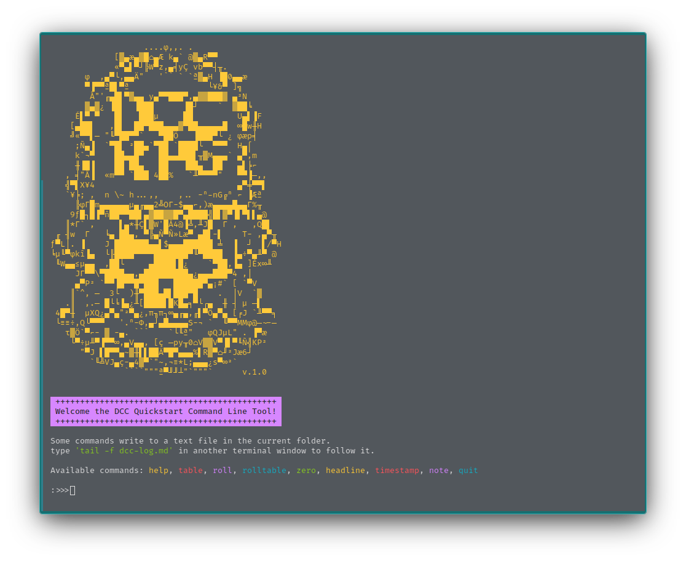
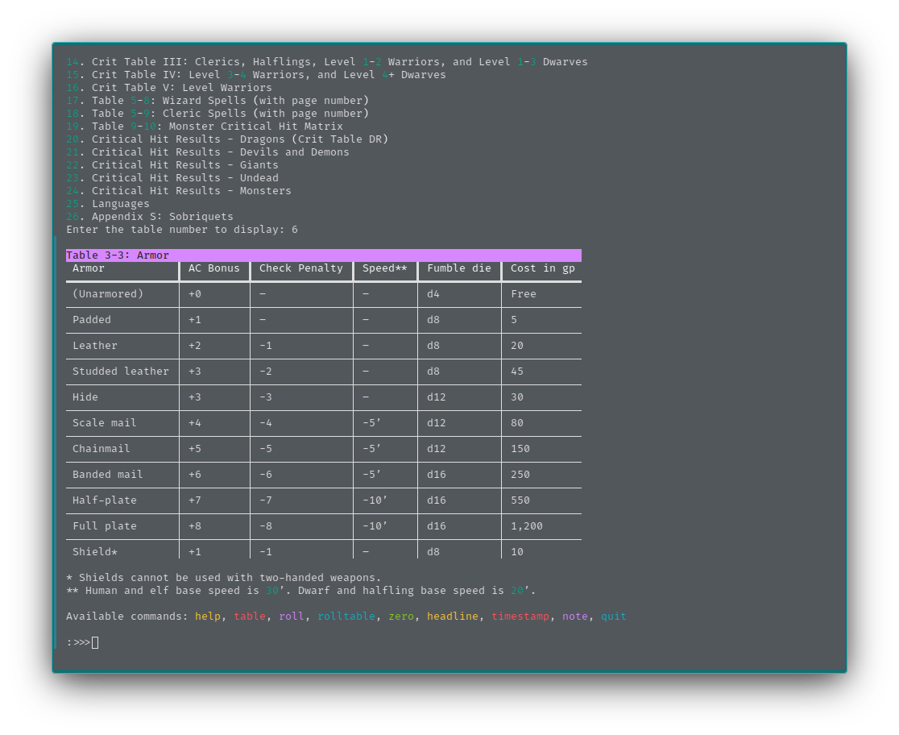
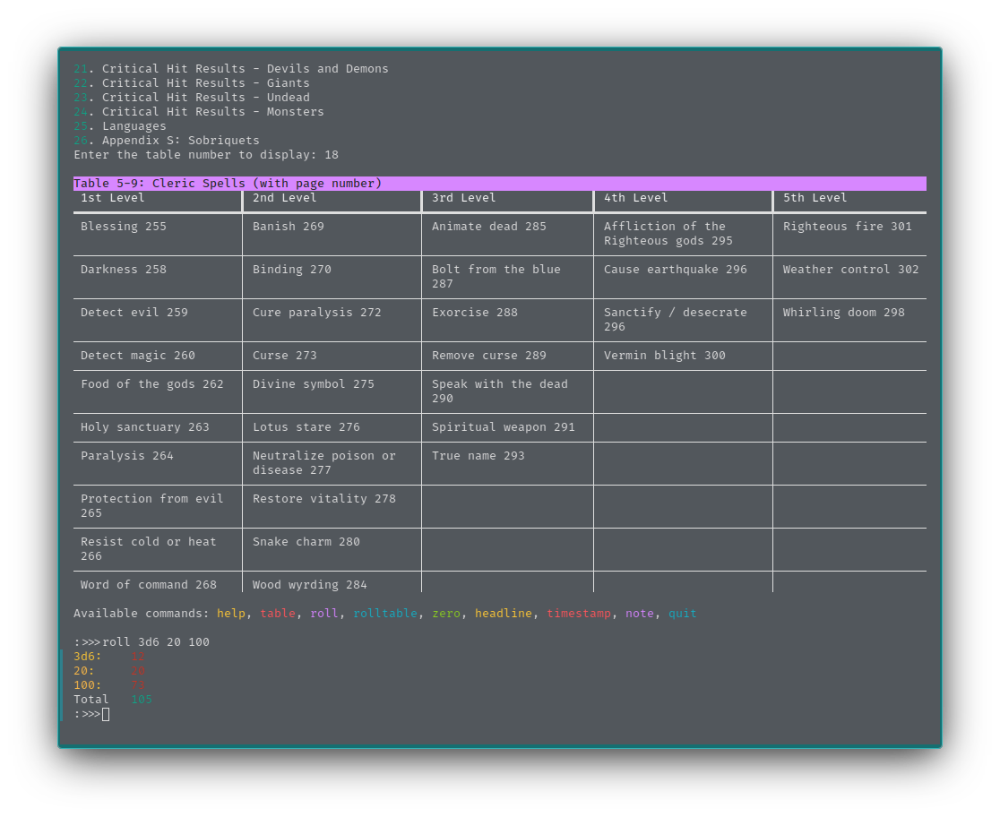

```
                   ....φ,,. .
             [▓▄æ▄▓█⌂▄Æ k▄` @▓▄R▀▀
             «▀▄▌▀┘╠W▀z,▄╡yÇ vb▀▀┤╥.
       φ  ,▄▀└,▄▄Ä"   '`` ` `ª▓▄H ▐█0▄▄æ
       ▀▐▀▀ª█▌▀ª                └¥&▀ ]╗
        Å"'╓▄█▌▀▓▄▄ y▄▀▀███▀,▄▓▓███▓ ▄²N
       ▓▄▓¿ ▐█▌  ▐███      ▐█┘    `  ▓██╘
     É▌▀ ▀   █▌   ███µ     ██         U▄▌▐F
    [▄██▌   ,█▌  ██▀███▄▄▄▓▀██▄▄▄▄▄█  ∞█w╫H
    ╝«▀▀▌─ "╙▀██▀▀`   ▀██Ö   ▐███▀└ ¿ φæp╡
     ;Ñ▄▐  `▀█▌ ²██▄`▀██ `████└  ▀▀▀  H▄⌠
     k`¬▀    ██▄▄█▀   ██▄▄███▌╥▓M▄▄▄` ▄▀,m
     ╫▐█▐    ██ ██▄   ██   ▐██▄  ██   ▄▌╞⌐
   , ╡"Å▐  «m▀▀ `███ 4██%   `╨▀▀▀▀"   ▀▀▐─,,
   ╣▀▌X¥4                             ▄▀╪▀▀▌
   `¥╞; ,  n \~ h...,,    ,.. -ⁿ-nG╔ⁿ ⌐ ▐ƪ
     ╠φΓ█m▄▄▄▄▄▄µ▄╓▄▄2╩OΓ-$▄▄⌐,)æ▄▄▄▄█▄▄Γ%╥
    9ƒ█┐█▐▀ñ██▀▀██▌▄▓██▓▓█▀▄████╣█▌▓▀▐▌▀▌▌▄@
   ║*Γ` ,     ▌▄*╫Ç▌▓W'█Å4@▐╩,╨J█  Γ ,   ,Q█▌
 ╓ ╢w  Γ   ╘▄ ██▄, ▀╠▄Ñ▀Ñ»Læ▀ ▄█▌-▌    T- ,▄▀╥
ƒ▀L│. ▐    J ███████▄▄▌$▄▄▄██████ ╧  ▐  ┘  ▌/▀H
╘µ╙▀φkî▐▄  └╟████▀▀▀▀███████▀╙▀████  ▐▄÷▀▄╨▀ @
 ╙W▄▄≤µ▄▄  ,██└     ▄████▌█¿    `▀██,▐▄ ]Éx∞╨
     JΓ▀▀\▀████▄▄,▄█████████▄¿▄▄▄███▀4 ,│
     ▄▀P² `▀▀▐█▀▀█▀███   ██████▀▄¡#` [ `▀V
    ║`^, ─  3└  )╫▀███▄█▌███▀█    .  │V  `▓
   .║  ,.─ █└╘▐▄¿╨[████▌█K█▄╕▀└┌▄  ╫ ┤ µ ─▌
 4█▀╫  µXQ¿▄▀▄"²▀▄¿,π╖π┐∞▄╓▄,╓▌▀Ö▄▀▄ [╒J `╨▀▀╕
 └≡≡÷,Q└▀▀▀   '.ⁿ-Φ,▄┘▄█▄▄▄▄S-¬ `  ╙▀▀MMφ@─~-─
   τ▓Ö`▀⌐- ▓ -▄. ```    `└╙ª"   φQJµL" . ▐▀æ
    └▀÷µ╨▀▐▀▀∞,▄V▄▄, [ç ─py╥0⌂V▓▓V▀▐▌▀╙Ñ╣KP²
      "▀J ▌█▀▀▄~▓╫▌▌██Ä▀█▀▄▄▄%▌R▓▀⌂╜²Jæ6┘
        `╙╩VJ▄ç-▄4▓▀`"~,¬≡*L;▄▄▄¿s▀∞²`
               ````"""ª▀╜╜┴"`"""`      v.1.0
```

# DCC-CLI

This is python script for quickly accessing tables used in the [Dungeon Crawl Classics](https://goodman-games.com/blog/2022/06/25/free-printed-dcc-quick-start-rules/) role-playing game.

To use this script, download the zip archive from the _code_ button above.
Extract the archive and move the folder to whichever location you want.

Inside the extracted directory is the _dcc-cli.py_ file that needs to be run with python.
You may need to install [python](https://www.python.org/downloads/).
On Mac or Linux you can use the application _Terminal_.
You will need to navigate into the directory with the script using the <code>cd</code> command.

On my computer I type:

``` 
cd Documents/game/dcc-cli
```

I can see the contents of the current folder by typing the <code>ls</code> command.

Once the terminal is in the correct directory, you can type <code>python dcc-cli.py</code> to run the program.

On Windows you should be able to type <code>python dcc-cli.py</code> in the _command promt_ (untested).

In addition to viewing tables, dcc-cli can roll dice, generate 0-levels, and keep a journal which is saved to a text file.

## Screenshots





## Available tables:
1. Table 1-1: Ability Score Modifiers
2. Table 1-2: Luck Score
3. Table 1-3: Occupation
4. Table 3-1: Weapons
5. Table 3-2: Ammunition
6. Table 3-3: Armor
7. Table 3-4: Equipment
8. Table 4-1: Attack Roll Modifiers
9. Table 4-2: Fumbles
10. Table 4-4: Turn Unholy Result by HD
11. Lay on Hands
12. Crit Table I: All 0-Level Characters
13. Crit Table II: All Thieves and Elves
14. Crit Table III: Clerics, Halflings, Level 1-2 Warriors, and Level 1-3 Dwarves
15. Crit Table IV: Level 3-4 Warriors, and Level 4+ Dwarves
16. Crit Table V: Level Warriors
17. Table 5-8: Wizard Spells (with page number)
18. Table 5-9: Cleric Spells (with page number)
19. Table 9-10: Monster Critical Hit Matrix
20. Critical Hit Results - Dragons (Crit Table DR)
21. Critical Hit Results - Devils and Demons
22. Critical Hit Results - Giants
23. Critical Hit Results - Undead
24. Critical Hit Results - Monsters
25. Languages
26. Appendix S: Sobriquets
